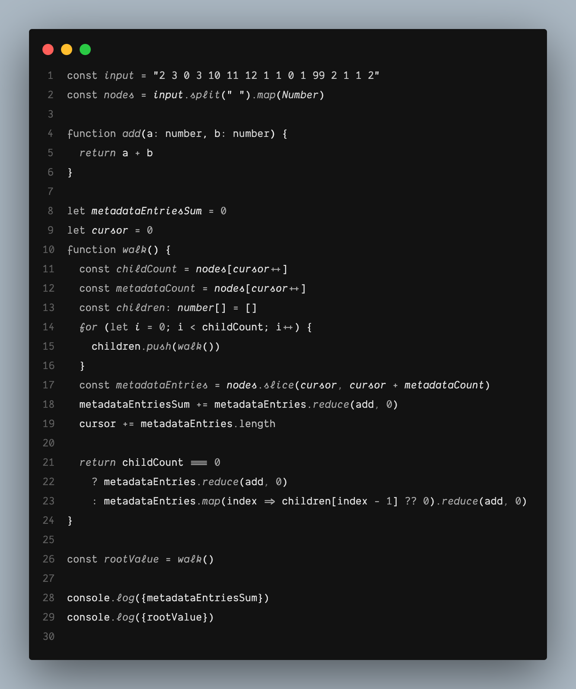

# Black Mono

A minimal monochrome VS Code theme. All grayscale, no distractions.

## Preview

See how code looks with Black Mono:

## Installation

1. Install [Visual Studio Code](https://code.visualstudio.com/)
2. Launch Visual Studio Code
3. Choose **Extensions** from menu
4. Search for `black mono`
5. Click **Install** to install it
6. Click **Reload** to reload the Code
7. From the menu bar click: Code > Preferences > Color Theme > **Black Mono**

## Disable Italics

If you wish to disable italics, there is a no-italic theme available. Select **Black Mono (No Italics)** as your color theme.
